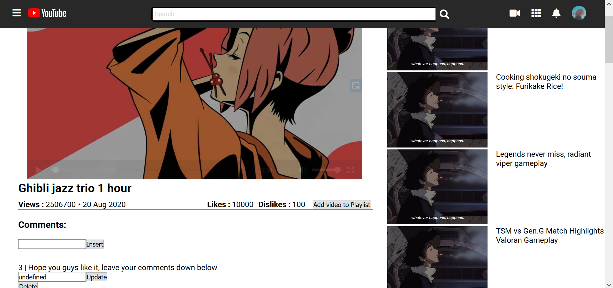

# YoutubeClone

This project was created because I want to learn more about angular dan graphql, i created this project in one and a half week so the front-end design is pretty bad, but the overall functionality is there

# HomePage

Infinite Scrolling to view the videos, 2 dropdown menus (1 with side transition and 1 with just overlay), fireAuth to sign in via google and clickable video to go to video-details

# Video Details

Playable video taken from videoUrl in Firestore database, lists for the next video to watch, CRUD for comment section and add the current video to your playlist

# Video Categories and Search

Search the video with the desired categories(music, food, gaming), search the video you want from the list of videos stored in the database

# Insert New Video

Insert new video to the database, uploaded video and thumbnail will be stored in firestore

# User Channel Video

Display all the videos uploaded by the user, user can choose to update or delete the videos

# User Playlist

Display the list of videos inside a playlist made by the user
